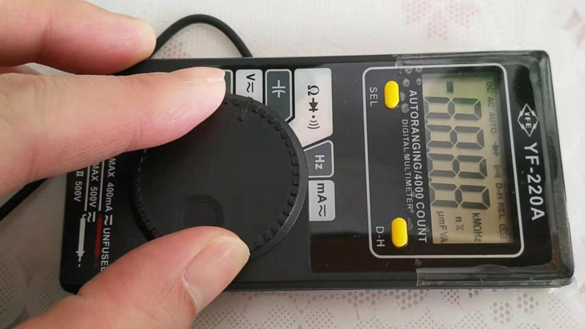

# TENMARS_YF-200A
LCD hack
setup, reference of code https://github.com/xiaolaba/mini-ohm-metre/tree/master/LCD_glass_ver3/ATmega168p_lcd_test

com-seg, 3-1/2, 4 digit LCD,  

7-seg x4, dot x 3,  
symbols : total 20 seg,  
DC, AC, AUTO, DIODE, BEEP, D-H, REL, BATTERY, -, K, M, Ohm, Hz, n, %, u, m, F, V, A  

